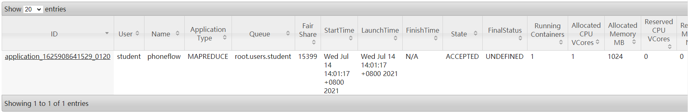
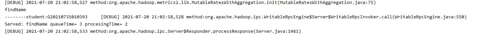
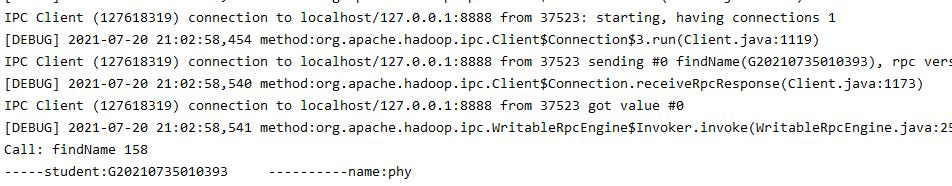
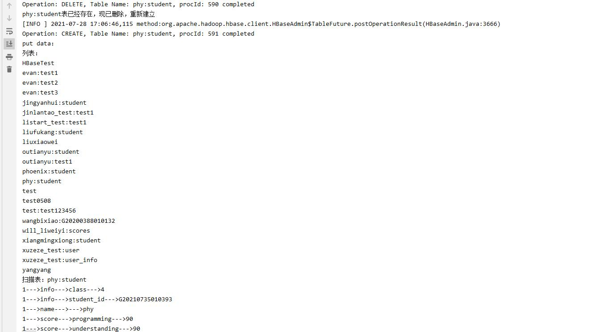
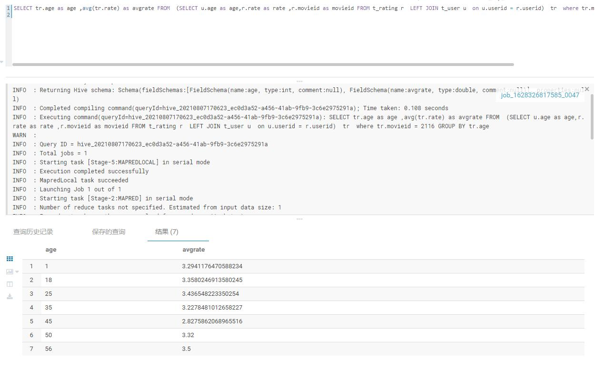
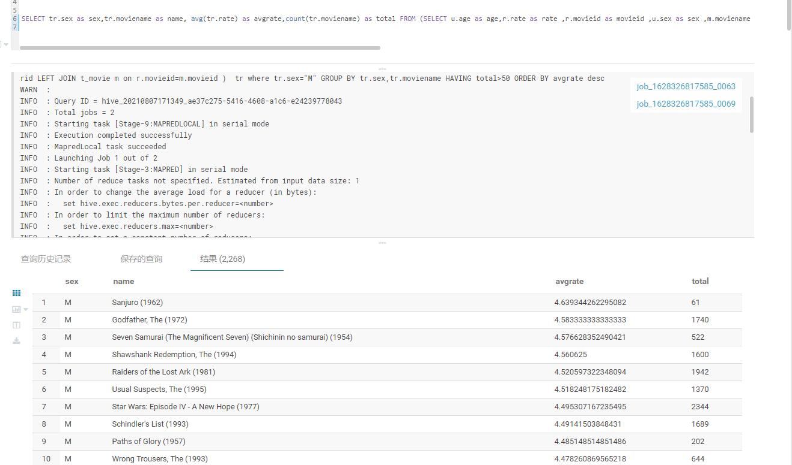
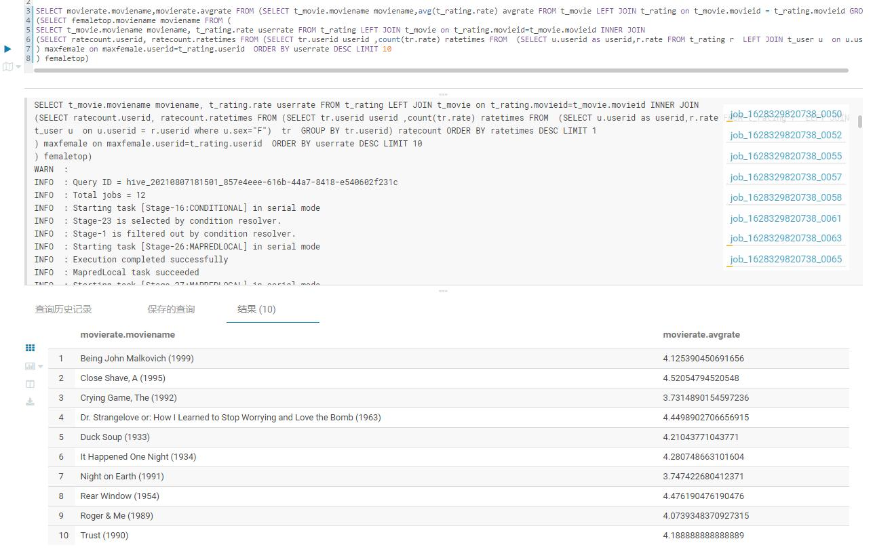
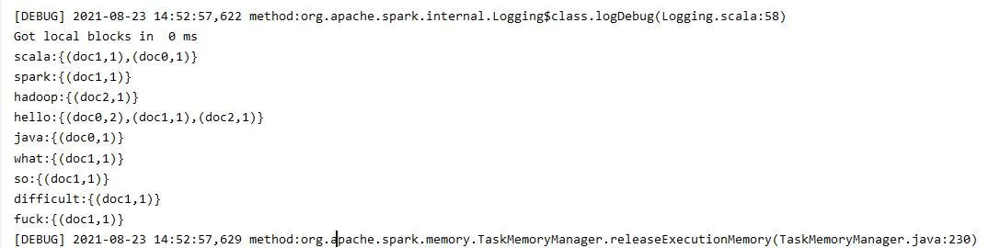
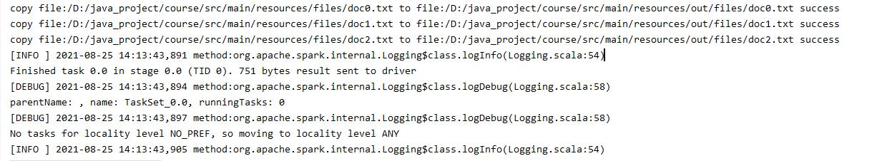

# javacode
### 1.javacode/src/main/java/homework1, phoneflow
<br>



### 2.javacode/src/main/java/homework2, rpc
<br>

服务端：<br>



客户端：<br>


<br>

### 3.javacode/src/main/java/homework3, hbase

<br>



<br>

### 4.javacode/src/main/java/homework4, hive
<br>
部分结果顺序不一样<br>
1.展示电影ID为2116这部电影各年龄段的平均影评分<br>
SELECT tr.age as age ,avg(tr.rate) as avgrate FROM  (SELECT u.age as age,r.rate as rate ,r.movieid as movieid FROM t_rating r  LEFT JOIN t_user u  on u.userid = r.userid)  tr  where tr.movieid = 2116 GROUP BY tr.age
<br>


<br>
2.找出男性评分最高且评分次数超过50次的10部电影，展示电影名，平均影评分和评分次数
<br>
SELECT tr.sex as sex,tr.moviename as name, avg(tr.rate) as avgrate,count(tr.moviename) as total FROM (SELECT u.age as age,r.rate as rate ,r.movieid as movieid ,u.sex as sex ,m.moviename FROM t_rating r  LEFT JOIN t_user u  on u.userid = r.userid LEFT JOIN t_movie m on r.movieid=m.movieid )  tr where tr.sex="M" GROUP BY tr.sex,tr.moviename HAVING total>50 ORDER BY avgrate desc limit 10
<br>


3.找出影评次数最多的女士所给出最高分的10部电影的平均影评分，展示电影名和平均影评分
<br>
SELECT movierate.moviename,movierate.avgrate FROM (SELECT t_movie.moviename moviename,avg(t_rating.rate) avgrate FROM t_movie LEFT JOIN t_rating on t_movie.movieid = t_rating.movieid GROUP BY t_movie.moviename) movierate WHERE movierate.moviename in
(SELECT femaletop.moviename moviename FROM (
SELECT t_movie.moviename moviename, t_rating.rate userrate FROM t_rating LEFT JOIN t_movie on t_rating.movieid=t_movie.movieid INNER JOIN
(SELECT ratecount.userid, ratecount.ratetimes FROM (SELECT tr.userid userid ,count(tr.rate) ratetimes FROM  (SELECT u.userid as userid,r.rate FROM t_rating r  LEFT JOIN t_user u  on u.userid = r.userid where u.sex="F")  tr  GROUP BY tr.userid) ratecount ORDER BY ratetimes DESC LIMIT 1
) maxfemale on maxfemale.userid=t_rating.userid  ORDER BY userrate DESC LIMIT 10
) femaletop)
<br>



<br><br>
### 5.javacode/src/main/java/homework5, spark rdd,discp

1.倒排索引
<br>
代码：src\main\java\homework5\InvertedIndex.scala
<br>
文件：
src\main\resources\files\doc0.txt doc1.txt doc2.txt
<br>
结果:src\main\resources\InvertedIndex
 
 <br>
 2.spark distcp
 <br>
 代码：src\main\java\homework5\DistCp.scala
 <br>
 本地测试，没搭集群，结果:src\main\resources\out
 <br>
  
  ```scala
      //参数解析
       args.sliding(2, 2).toList.collect {
            case Array("-source", sc: String) => inputPath = sc
            case Array("-target", tg: String) => outputPath = tg
            case Array("-i", ignore: String) => ignore_failures = ignore.toBoolean
            case Array("-task", mc: String) => max_concurrence= mc.toInt
      
          }
      //遍历目录
      traverseDir(configuration,inputPath,true,filePaths,dirPaths)
      //创建目录
      createDirs(dirPaths,inputroot,outputroot,configuration)
      //拷贝
      distcp(inputroot,outputroot,filePaths,sparkContext,confBroadcast.value.value,ignore_failures,max_concurrence)
  ```
### 6.javacode/src/main/java/homework6, spark sql
文档：src\main\java\homework6\homework6.md