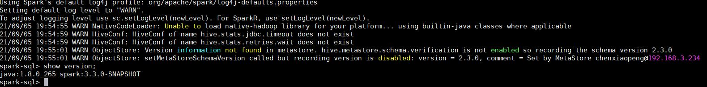
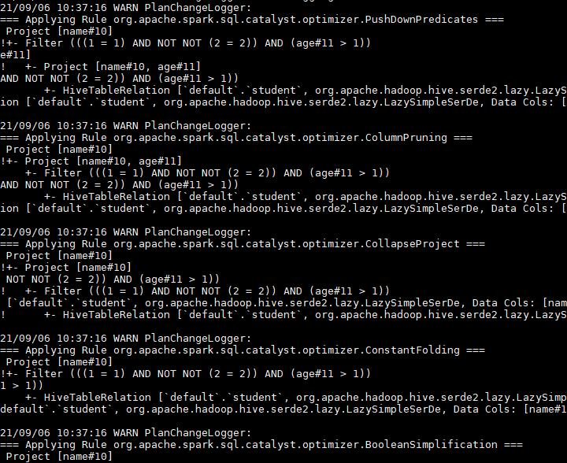
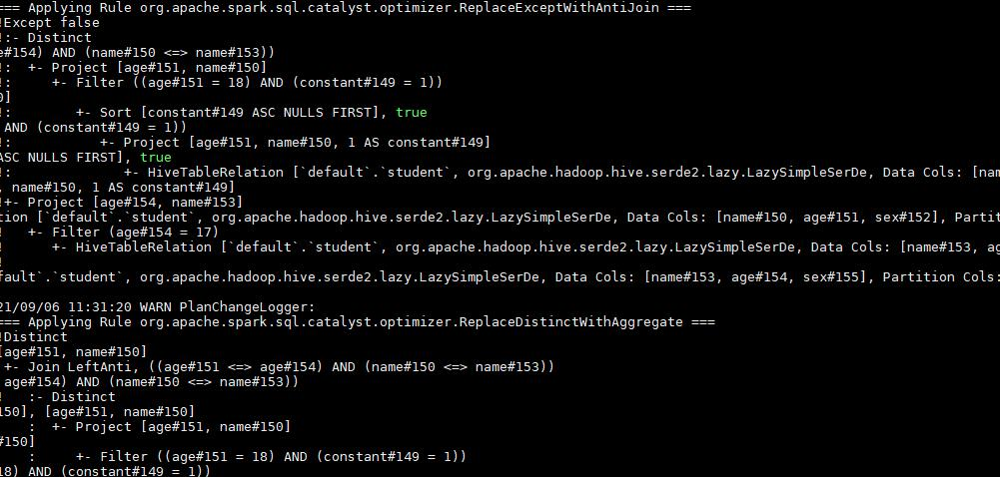
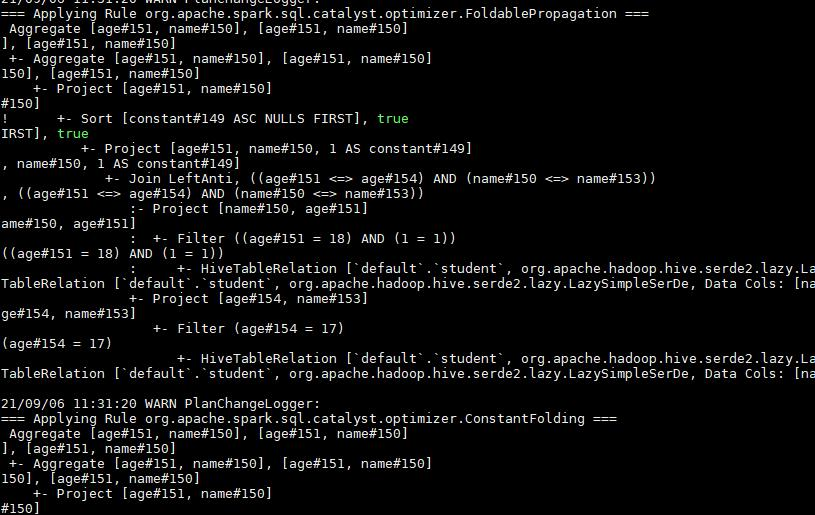
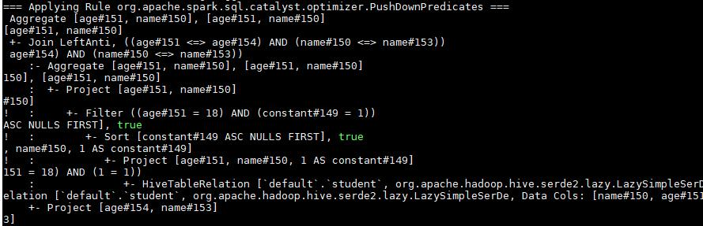
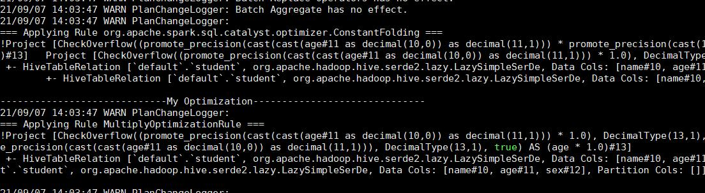

### 6.javacode/src/main/java/homework6, spark sql

#### 1.为Spark SQL添加一条自定义命令<br>

  • SHOW VERSION;<br>
  • 显示当前Spark版本和Java版本<br>
   新建command:<br>
   ```scala
package org.apache.spark.sql.execution.command

import org.apache.spark.sql.{Row, SparkSession}
import org.apache.spark.sql.catalyst.expressions.{Attribute, AttributeReference}
import org.apache.spark.sql.types.StringType


case class ShowVersionCommand() extends LeafRunnableCommand {

  override val output: Seq[Attribute] =
    Seq(AttributeReference("version", StringType, nullable = true)())

  override def run(sparkSession: SparkSession): Seq[Row] = {

    val javaVersion = System.getProperty("java.version");
    val sparkVersion = sparkSession.sparkContext.version
    val version = "java:" + javaVersion + " spark:" + sparkVersion
    Seq(Row(version))
  }
}
   ```
<br>
SparkSqlParser.scala添加代码<br>

   ```scala
override def visitShowVersion(ctx: ShowVersionContext): LogicalPlan = withOrigin(ctx) {
    ShowVersionCommand()
  }
   ```

<br>
SqlBase.g4 文件添加：<br>

```scala

statement
    | SHOW VERSION 

ansiNonReserved
    | VERSION

nonReserved
    | VERSION
VERSION: 'VERSION' 
```
<br>
linux编译测试成功：<br>

 
 
#### 2.构建SQL满足如下要求

通过set spark.sql.planChangeLog.level=WARN;查看<br>
建表:<br>
```sql
create table student  (name string, age  integer, sex string);
```
1. 构建一条SQL，同时apply下面三条优化规则：
CombineFilters CollapseProject BooleanSimplification
 ```sql

select name from ( select name,age from student ) where 1=1 and !(2!=2) and age>1;
```
 
2. 构建一条SQL，同时apply下面五条优化规则：
ConstantFolding PushDownPredicates ReplaceDistinctWithAggregate ReplaceExceptWithAntiJoin FoldablePropagation
<br>
```sql
select distinct age,name from (select age,name,1 constant  from student order by constant) a where a.age=18 and constant=1 except select age,name from student where age=17;
```
<br>

 
 
 
  
 
 
 <br>
 
 #### 3. 实现自定义优化规则（静默规则）
 环境太难搞了 终于打包运行成功了<br>
 第一步 实现自定义规则（静默规则，通过set spark.sql.planChangeLog.level=WARN;确认执行到就行）<br>
 ```scala
import org.apache.spark.sql.SparkSession
import org.apache.spark.sql.catalyst.expressions.{Literal, Multiply}
import org.apache.spark.sql.catalyst.plans.logical.LogicalPlan
import org.apache.spark.sql.catalyst.rules.Rule
import  org.apache.spark.sql.types.Decimal

case class MultiplyOptimizationRule(spark: SparkSession) extends Rule[LogicalPlan] {
  def apply(plan: LogicalPlan): LogicalPlan = plan transformExpressions  {
    case Multiply(left,right,error) if right.isInstanceOf[Literal] &&
      right.asInstanceOf[Literal].value.isInstanceOf[Decimal] => //value.asInstanceOf[Decimal] == 1.0
      println("-----------------------------My Optimization------------------------------")
      left

  }
}

```
 <br>
 第二步 创建自己的Extension并注入<br>
 
 ```scala

import org.apache.spark.sql.SparkSessionExtensions

class MySparkSessionExtension extends (SparkSessionExtensions => Unit) {
  override def apply(extensions: SparkSessionExtensions): Unit = {
    extensions.injectOptimizerRule { session =>
      new MultiplyOptimizationRule(session)
    }
  }
}

```
 <br>
 第三步 通过spark.sql.extensions提交<br>
 bin/spark-sql --jars my.jar --conf spark.sql.extensions=MySparkSessionExtension<br>
 
  
 
 
